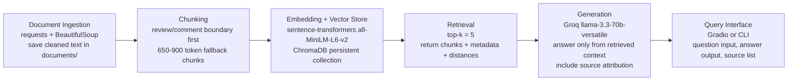

# Project 1 Planning: The Unofficial Guide

> Write this document before you write any pipeline code.
> Your spec and architecture diagram are what you'll use to direct AI tools (Claude, Copilot, etc.) to generate your implementation — the more specific they are, the more useful the generated code will be.
> Update the Retrieval Approach and Chunking Strategy sections if you change your approach during implementation.
> Update this file before starting any stretch features.

---

## Domain

Student-generated advice for choosing Georgia Tech OMSCS AI/ML-related courses. The system will focus on practical questions that the official catalog does not answer well: real weekly workload, difficulty, prerequisite background, grading pain points, TA/course support, whether a course is good as a first OMSCS class, and whether it can be paired with another course. This knowledge is valuable because OMSCS students often work full-time and need realistic planning advice, but the most useful details are scattered across long review pages and Reddit threads rather than summarized in one official place.

---

## Documents

| # | Source | Description | URL or location |
|---|--------|-------------|-----------------|
| 1 | OMSCentral - Machine Learning reviews | Student reviews of CS 7641, especially workload, grading, prerequisites, and whether the course is manageable while working full-time. | https://www.omscentral.com/courses/machine-learning/reviews |
| 2 | OMSCentral - Artificial Intelligence reviews | Student reviews of CS 6601, including reports on assignments, exams, math expectations, and course pacing. | https://www.omscentral.com/courses/artificial-intelligence/reviews |
| 3 | OMSCentral - Deep Learning reviews | Student reviews of CS 7643, with comments on projects, quizzes, readings, group work, and expected weekly hours. | https://www.omscentral.com/courses/deep-learning/reviews |
| 4 | OMSCentral - Reinforcement Learning and Decision Making reviews | Student reviews of CS 7642, focused on papers, projects, algorithms, workload, and difficulty. | https://www.omscentral.com/courses/reinforcement-learning-and-decision-making/reviews |
| 5 | OMSCentral - Natural Language Processing reviews | Student reviews of CS 7650, including background expectations, lecture quality, exams, and recent course changes. | https://www.omscentral.com/courses/natural-language-processing/reviews |
| 6 | OMSCentral - Knowledge-Based AI reviews | Student reviews of CS 7637, including writing-heavy workload, peer review, Ed participation, and perceived usefulness. | https://www.omscentral.com/courses/knowledge-based-ai/reviews |
| 7 | OMSCentral - Machine Learning for Trading reviews | Student reviews of CS 7646, including whether it works as an intro ML course, Python/pandas expectations, and project pacing. | https://www.omscentral.com/courses/machine-learning-for-trading/reviews |
| 8 | OMSCentral - AI, Ethics, and Society reviews | Student reviews of CS 6603, including workload, course design, assignments, and whether it is a light or pairable course. | https://www.omscentral.com/courses/ai-ethics-and-society/reviews |
| 9 | r/OMSCS - Has anyone actually had a good experience with OMSCS's workload? | Reddit discussion comparing perceived workload across OMSCS courses and explaining why OMSCentral hour estimates can differ from individual experience. | https://www.reddit.com/r/OMSCS/comments/1rk9zh9/has_anyone_actually_had_a_good_experience_with/ |
| 10 | r/OMSCS - Machine Learning for Trading First OMSCS Course? | Reddit thread about whether ML4T is suitable as a first OMSCS course, with comments on feedback delays, project cadence, and grading. | https://www.reddit.com/r/OMSCS/comments/1mkkwfh/machine_learning_for_trading_first_omscs_course/ |

---

## Chunking Strategy

**Chunk size:** I will chunk by natural review/comment boundaries first, not by a blind fixed character count. Each OMSCentral review or Reddit comment will become one candidate chunk when it is short enough. If a review/comment is longer than about 900 tokens, I will split it into sentence-aware chunks around 650-900 tokens. This is a small implementation adjustment from paragraph-only splitting because several source pages collapse review bodies into dense HTML text without reliable paragraph boundaries.

**Overlap:** Short review/comment chunks will have no overlap because each one is already a complete opinion unit. Long split chunks will use about 100 tokens of overlap so that context such as the course name, assignment name, or conclusion is not lost across a boundary.

**Reasoning:** The corpus is mostly opinion-heavy student writing rather than one continuous textbook-style document. A single review often contains the complete context for a student's background, workload estimate, rating, and advice, so preserving that boundary should make retrieval more useful than slicing every few hundred characters. For long reviews, sentence-aware splitting keeps related complaints or recommendations together while preventing one very long review from crowding out other retrieved evidence. Each chunk will keep metadata for `source_name`, `url`, `course`, `source_type`, and `chunk_index` so the generation step can cite where an answer came from.

**Milestone 3 implementation note:** The final ingestion run produced 984 chunks across 10 sources, with no chunks over 900 tokens after adding source/course context.

---

## Retrieval Approach

**Embedding model:** `all-MiniLM-L6-v2` through `sentence-transformers`. It runs locally, is already suggested by the project stack, is fast enough for a small course-review corpus, and does not require a paid embedding API.

**Top-k:** Retrieve the top 5 chunks for each user question. This should give enough variety for questions that compare courses while still keeping the generation context focused. During Milestone 4 testing, I will inspect returned chunks and distances; if top results are consistently noisy, I will adjust top-k or add a relevance threshold.

**Production tradeoff reflection:** For a real advising tool, I would compare the local MiniLM model with a larger hosted embedding model that may handle longer, messier reviews and subtle wording better. I would weigh retrieval accuracy against latency, cost, privacy, and operational complexity. I would also consider context length, because some reviews contain background, workload, grading, and advice in one long post; a model that represents longer text well might reduce the need for aggressive splitting. Multilingual support is not a major requirement for this English-heavy corpus, but it would matter if the system expanded to international student forums.

**Milestone 4 implementation note:** The final retrieval script uses `all-MiniLM-L6-v2`, stores 984 chunk embeddings in a persistent ChromaDB collection, and retrieves top-k 5 chunks with distance scores and source metadata. I added a course-aware metadata filter for questions that explicitly name a course or course code, because terms like "AI" can otherwise retrieve adjacent but wrong course pages such as KBAI.

---

## Evaluation Plan

| # | Question | Expected answer |
|---|----------|-----------------|
| 1 | What do student reviews say about taking CS 7641 Machine Learning while working full-time? | The answer should say that many students describe ML as high workload and stressful, especially because of assignments and grading uncertainty. It should avoid claiming every student has the same experience, because reviews vary by background and semester. |
| 2 | Is Machine Learning for Trading a reasonable first OMSCS AI/ML course, and what should a new student watch out for? | The answer should say ML4T is often described as a gentler intro to Python, pandas/numpy, finance, and ML concepts, but students warn about report formatting, project cadence, hidden tests/rubrics, and sometimes delayed feedback. |
| 3 | What background do students recommend before taking Artificial Intelligence? | The answer should mention Python/numpy, probability/statistics, some linear algebra, comfort with algorithms/search, and starting assignments early. It should also mention that exam and project workload can be time-consuming. |
| 4 | How do students describe Knowledge-Based AI compared with more engineering-oriented AI/ML courses? | The answer should say KBAI is often described as more writing/conceptual/humanities-like, with frequent assignments, peer review, and participation work, rather than a pure programming-heavy AI/ML engineering course. |
| 5 | What changed or frustrated students in recent Natural Language Processing reviews? | The answer should mention recent concerns about closed-book/proctored quizzes or exams, mixed reactions to Meta/guest lecture material, TA/course-policy changes, and still note that many students praise the main professor's lectures. |

---

## Anticipated Challenges

1. Reviews are subjective and sometimes contradict each other. A student with a strong CS/math background may call a course manageable while another student calls the same course overwhelming. The generation step must summarize the range of evidence instead of flattening it into one absolute recommendation.

2. Source pages contain repeated navigation text, ratings, metadata, and many short review blocks. If ingestion does not clean the HTML carefully, retrieval may return menus or duplicate boilerplate instead of student advice. The ingestion step needs to preserve useful metadata like course name, rating, difficulty, workload, semester, and URL while removing page chrome.

3. Some user questions may ask for guarantees or personal advising beyond the documents, such as "Which class will definitely give me an A?" The system should not invent certainty. If retrieved chunks do not support a specific answer, the generation step should say the documents do not contain enough information.

4. Course pages change over time, and some Reddit links may become unavailable or difficult to scrape. I will store fetched raw/cleaned text locally in the `documents/` folder so the project remains reproducible after collection.

---

## Architecture

The pipeline will keep source metadata attached from ingestion through generation. The final response should include both a short answer and a source list so a user can verify which reviews or threads supported the answer.

---

## AI Tool Plan

**Milestone 3 - Ingestion and chunking:** I will give Codex the Domain, Documents, and Chunking Strategy sections and ask it to implement a small ingestion script that fetches each URL, removes navigation/boilerplate, stores cleaned text under `documents/`, and chunks by review/comment boundaries with the long-review fallback described above. I expect it to produce Python functions such as `load_sources()`, `clean_html()`, and `chunk_documents()`. I will verify the output by reading at least 5 sample chunks and checking that each chunk contains real student advice plus correct source metadata.

**Milestone 4 - Embedding and retrieval:** I will give Codex the Retrieval Approach and Architecture sections and ask it to create a ChromaDB indexing script plus a retrieval function. I expect code that embeds chunks with `all-MiniLM-L6-v2`, persists the vector store, and returns top-k chunks with metadata and distance scores. I will verify it by running the 5 evaluation questions before generation and manually checking that the returned chunks are relevant.

**Milestone 5 - Generation and interface:** I will give Codex the Evaluation Plan, Architecture, and grounding requirements from the project page. I expect it to build an `ask(question)` function that retrieves context, calls Groq's `llama-3.3-70b-versatile`, and returns an answer with source attribution. I will verify it by asking answerable questions and at least one question that the documents do not cover; the system should cite sources for supported answers and refuse to guess when the evidence is missing.
